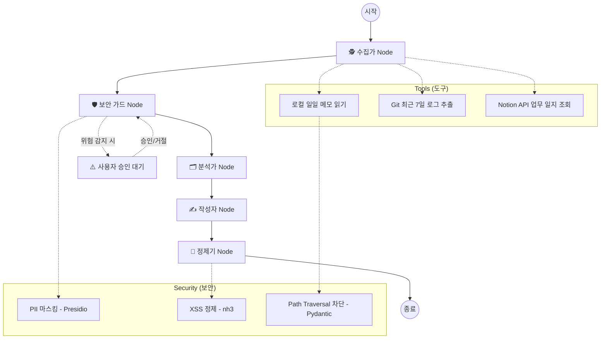

# 🚀 포트폴리오: Auto-Weekly Report Swarm (주간 보고서 자동화 에이전트)

**포지션:** AI Agent Engineer / AX Consultant  
**기술 스택:** Python, LangGraph, Google Gemini 3 Flash, Streamlit, LangChain, Presidio, nh3, OWASP ASI  
**개발 시기:** 2026.05  

---

## 1. 프로젝트 개요 (Project Overview)
**"파편화된 업무 기록을 하나의 완벽한 비즈니스 리포트로 변환하는 자율형 에이전트"**

개발자 및 기획자가 매주 작성해야 하는 주간 업무 보고서의 번거로움을 해결하기 위해 기획된 프로젝트입니다. 사용자의 로컬 폴더에 흩어진 일일 메모(`.txt`, `.md`), 로컬 저장소의 `Git 커밋 로그`, 그리고 **Notion 데이터베이스의 업무 일지**를 AI가 직접 수집하고, 카테고리별로 분류한 뒤, 임원 보고용 마크다운(Markdown) 리포트로 자동 완성해 주는 Multi-Agent(Swarm) 시스템입니다.

## 2. 시스템 아키텍처 (Architecture)

LangGraph를 활용하여 각각의 명확한 역할을 가진 **5개의 노드(Node)**가 순차적으로 협업하는 보안 강화 파이프라인을 구축했습니다.

1. **Collector Node (수집가):** LLM의 자율성에 전적으로 의존하지 않고, 결정론적(Deterministic) 파이썬 함수 도구를 강제 호출하여 데이터 누락 및 환각(Hallucination) 현상을 원천 차단했습니다.
2. **Analyzer Node (분석가):** 수집된 Raw 데이터를 Gemini 3 Flash 모델에 주입하여 `[완료된 작업]`, `[진행 중/예정 작업]`, `[이슈 및 블로커]` 3가지 핵심 카테고리로 매핑합니다.
3. **Writer Node (작성자):** 정제된 분석 데이터를 기반으로 대기업 임원 보고용 표준 포맷에 맞추어 개조식 마크다운 문서를 작성합니다.

## 3. 핵심 구현 기능 (Key Features)

* **결정론적 데이터 파이프라인 설계:** 안정적인 실무 도입을 위해 Agentic 한 자율 탐색보다는, 정해진 도구(`tools.py`)를 통해 확실하게 데이터를 긁어오도록 제어하여 프로토타입의 신뢰성을 높였습니다.
* **Streamlit 기반 원클릭 대시보드:** 터미널 환경에 익숙하지 않은 일반 직군도 사용할 수 있도록 Streamlit 웹 UI를 구축했습니다. 로딩 상태 시각화(`st.spinner`) 및 결과물 즉시 다운로드 기능을 제공합니다.
* **동적 컨텍스트 주입:** `datetime` 모듈을 활용해 생성 시점의 날짜 정보를 파일명(`Weekly_Report_YYYY-MM-DD.md`)과 LLM 프롬프트 시제(Tense)에 실시간으로 반영합니다.
* **OWASP ASI 기반 3-Layer 보안:** Shift-Left DLP(PII 마스킹), 프롬프트 인젝션 탐지 및 동적 개입(`interrupt()`), 그리고 XSS 출력 정제(`nh3`)를 적용한 엔터프라이즈급 에이전트 보안 아키텍처를 구현했습니다.
* **도구 입력 유효성 검증:** Pydantic `field_validator`를 활용하여 에이전트의 Path Traversal 공격을 원천 차단하는 방어적 도구 설계를 적용했습니다.

## 4. 기술적 문제 해결 과정 (Troubleshooting)

프로젝트를 진행하며 발생한 기술적 이슈들을 최신 프레임워크 생태계에 맞춰 해결했습니다.

**① LangGraph 메모리 덮어쓰기 문제 (Human-in-the-loop 구축)**
* **Issue:** 챗봇 형태의 피드백 루프를 구현하기 위해 `MemorySaver`를 부착했으나, 단순 `TypedDict` 구조에서는 상태가 매번 초기화/덮어쓰기 되어 대화 맥락이 유실됨.
* **Solution:** LangGraph 2026년도 표준 패턴에 맞추어 상태 관리 객체(`ReportState`)에 `messages: Annotated[list, add_messages]` 필드를 추가하여, 사용자의 피드백 히스토리가 누적되도록 아키텍처를 재설계했습니다.

**② LangChain v4.0 응답 타입 파싱 에러**
* **Issue:** 최신 `langchain-google-genai` 업데이트로 인해, Gemini 모델의 응답(`result.content`)이 단일 텍스트(`str`)가 아닌 멀티모달 확장을 대비한 리스트(`list`) 형태로 반환되어 파일 쓰기 중 `TypeError` 발생.
* **Solution:** 응답 타입이 `list`인지 `str`인지 동적으로 검사하여 텍스트만 안전하게 추출해 내는 `get_text_content` 헬퍼 함수를 구현하여 파이프라인의 견고함을 확보했습니다.

**③ 환경 변수 로드와 인스턴스화 순서 충돌**
* **Issue:** `app.py` 구동 시, `load_dotenv()`가 실행되기 전에 모델 모듈이 먼저 `import` 되면서 API 키 참조 에러(`pydantic ValidationError`) 발생.
* **Solution:** Python의 모듈 평가(Evaluation) 순서를 제어하여, 환경 변수 주입이 모든 서드파티 AI 인스턴스화 작업보다 우선적으로 처리되도록 Import 계층도를 리팩토링했습니다.

## 5. 향후 확장 계획 (Roadmap)

| 단계 | 목표 | 상태 |
|------|------|------|
| Phase 1 | CLI + Streamlit 기본 파이프라인 구축 | ✅ 완료 |
| Phase 2 | LangGraph MemorySaver 기반 대화형 피드백 루프 | ✅ 완료 |
| Phase 3 | Notion API 연동을 통한 외부 클라우드 데이터 소스 확장 | ✅ 완료 |
| Phase 4 | FastAPI 서버 배포 + 스케줄러(Cron) 기반 자동 실행 | 🔜 예정 |
| Phase 5 | OWASP ASI 기반 에이전트 보안 레이어 적용 (PII 마스킹, XSS 정제, HITL) | ✅ 완료 |

---

## 📎 Links

| 항목 | URL |
|------|-----|
| GitHub Repository | [uzzano-info/auto-weekly-report](https://github.com/uzzano-info/auto-weekly-report) |
| Streamlit 데모 | [자동 주간 보고서 앱](https://auto-week-o4ffjlbsd7arcvstyqzpxh.streamlit.app/) |

---
*본 문서는 AI Agent Engineer 포지션 전환을 위한 12주 실행 로드맵의 포트폴리오 산출물 중 하나로 작성되었습니다.*
